傻瓜式教程《如何使用 Clash 翻墙》，本文于 **2023 年 7 月 1 日** 发布于 https://github.com/Sha1rholder/Clash-against-GFW 并持续更新。点击 [此处](https://github.com/Sha1rholder/Clash-against-GFW/README.pdf) 下载最新版教程，欢迎转载

- [订阅机场，获取节点](#订阅机场获取节点)
- [Windows10/11](#windows1011)
  - [安装 Clash for Windows](#安装-clash-for-windows)
  - [（可选）汉化 Clash](#可选汉化-clash)
  - [导入配置文件](#导入配置文件)
  - [配置 Clash](#配置-clash)
- [Android/HarmonyOS](#androidharmonyos)
  - [安装 Clash for Android](#安装-clash-for-android)
  - [导入配置文件](#导入配置文件-1)
  - [配置 Clash](#配置-clash-1)
- [Tips](#tips)
  - [我上不了 GitHub](#我上不了-github)
  - [Clash 中代理模式的区别](#clash-中代理模式的区别)
  - [Windows 突然无法上网](#windows-突然无法上网)
  - [无法使用 ChatGPT、Netflix 等特定服务](#无法使用-chatgptnetflix-等特定服务)

# 订阅机场，获取节点

以 GlaDOS 为例，注册成为用户 https://glados.space/landing/UFR6K-QAGM5-DO95Q-KQPCR （末尾为我的邀请码，通过邀请码注册可以获得额外的订阅时长）  
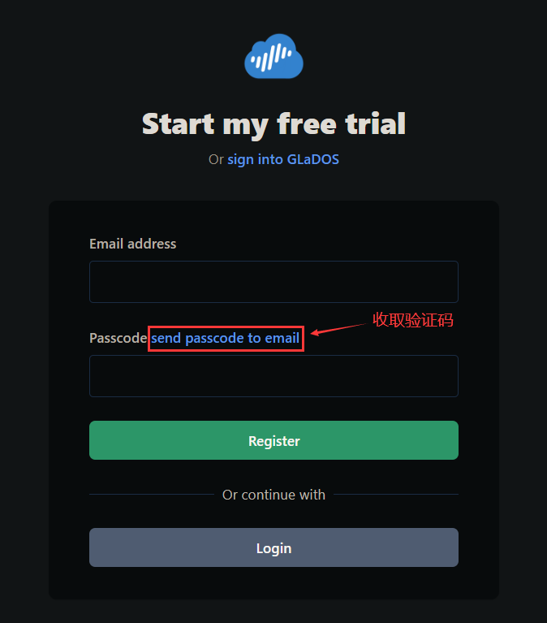

（可选）**如果你是学生且有一个 edu 教育邮箱**，可以免费获得一年的 GlaDOS 订阅时长。打开 https://glados.rocks/console/education 并在页面底部验证你的教育邮箱（偶尔会出现无法验证的情况，请过一天再试）  
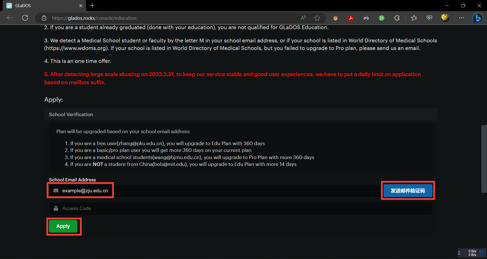

如果你不是学生或没有 edu 教育邮箱，请在 https://glados.rocks/console/shop 页面选择合适的套餐并购买  
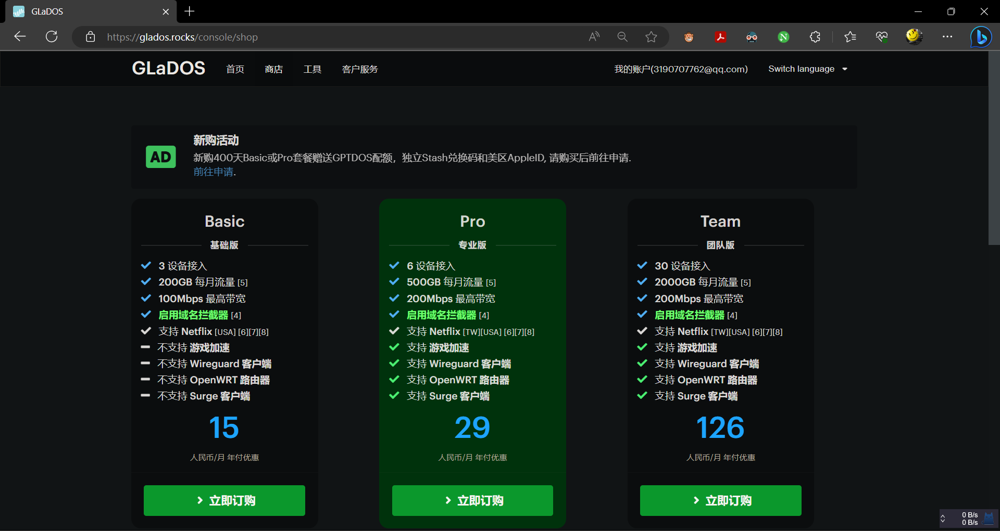

# Windows10/11

## 安装 Clash for Windows

在 Clash for Windows 的 GitHub 页面 https://github.com/Fndroid/clash_for_windows_pkg/releases 找到最新版本的发布页，点击红框中的最新版本号（截至 2023 年 7 月 1 日，最新版 Clash for Windows 为 v0.20.27）  
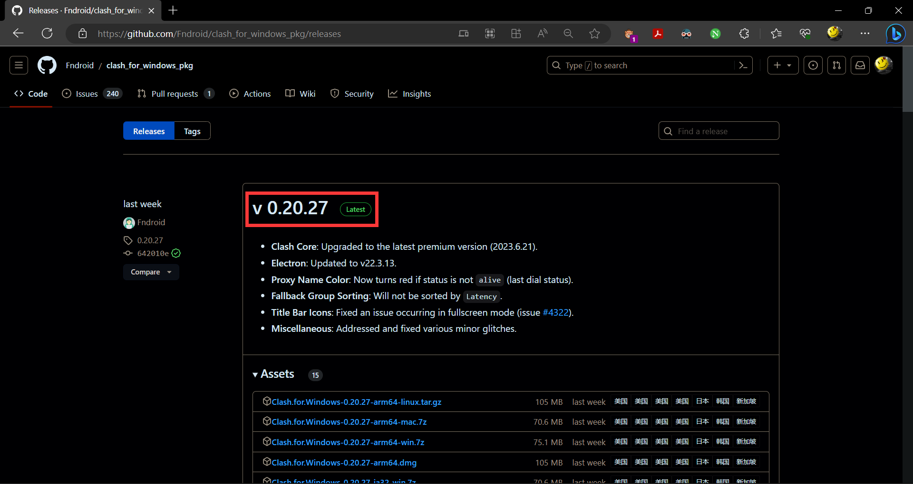

如果无法下载，可以参考 Tips [我上不了 GitHub](#我上不了-github) 加速 GitHub 后下载

下载你的电脑对应架构的安装包（通常是 x64，对应下图红框中安装包）  
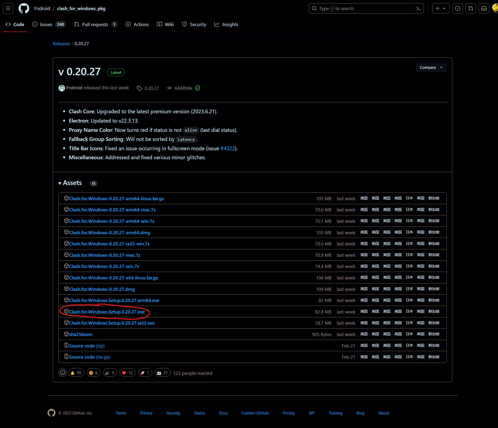

打开已下载的.exe 文件，根据指引安装 Clash for Windows，记住文件路径

## （可选）汉化 Clash

在 Clash_Chinese_Patch 的 GitHub 页面 https://github.com/BoyceLig/Clash_Chinese_Patch/releases/ 找到对应你 clash 版本的发布页，点击红框中的最新版本号（截至 2023 年 7 月 1 日，最新版汉化补丁为 v0.20.27）  
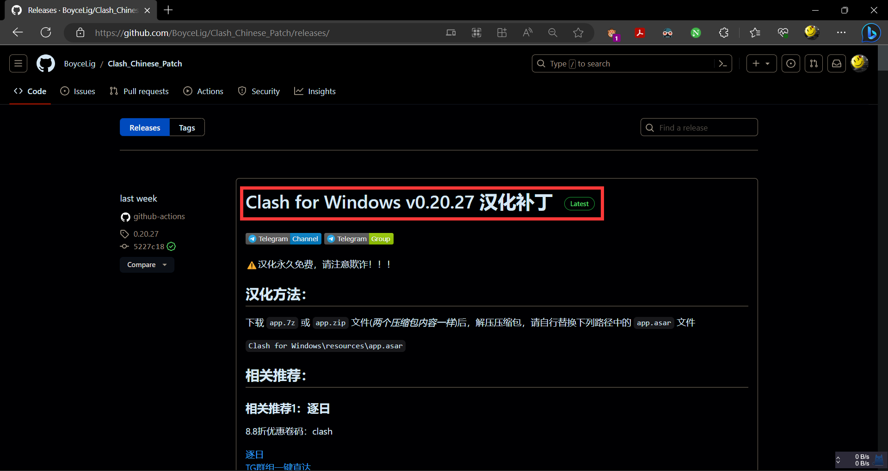

下载.zip 压缩包  
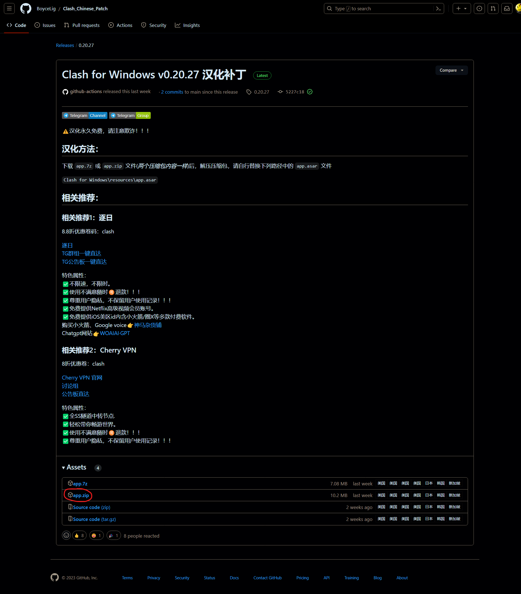

双击进入压缩包，并找到 Clash for Windows 的安装目录，将压缩包中的 app.asar 粘贴到该目录下替换原本的 app.asar 文件  
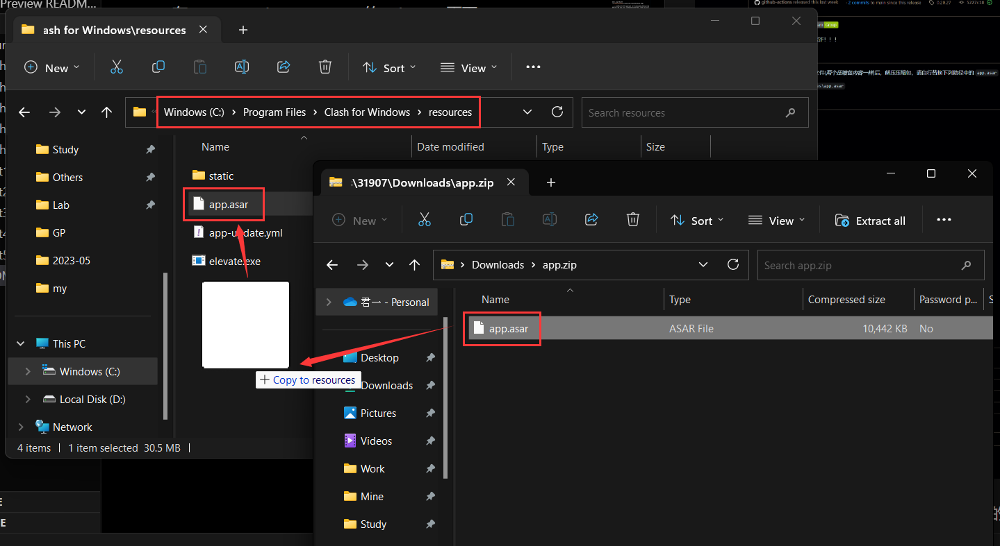  
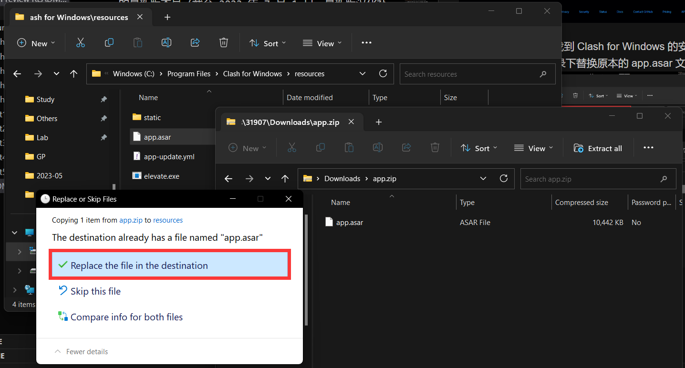

## 导入配置文件

参考上文订阅 GlaDOS 后，在 https://glados.rocks/console/clash 页面将配置文件导入 Clash  
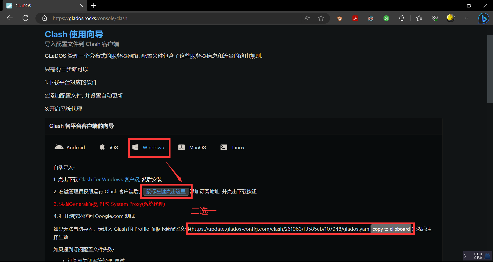  
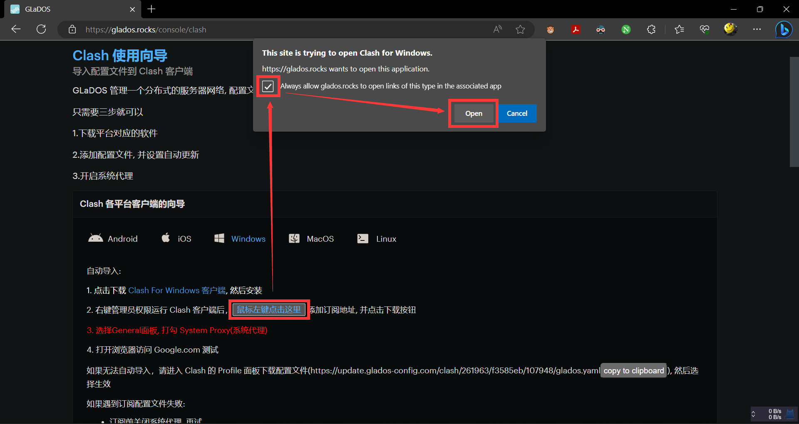

打开 Clash 界面，查看配置文件是否已成功导入。若成功导入则左键点击切换到该配置文件（左边出现绿条）  
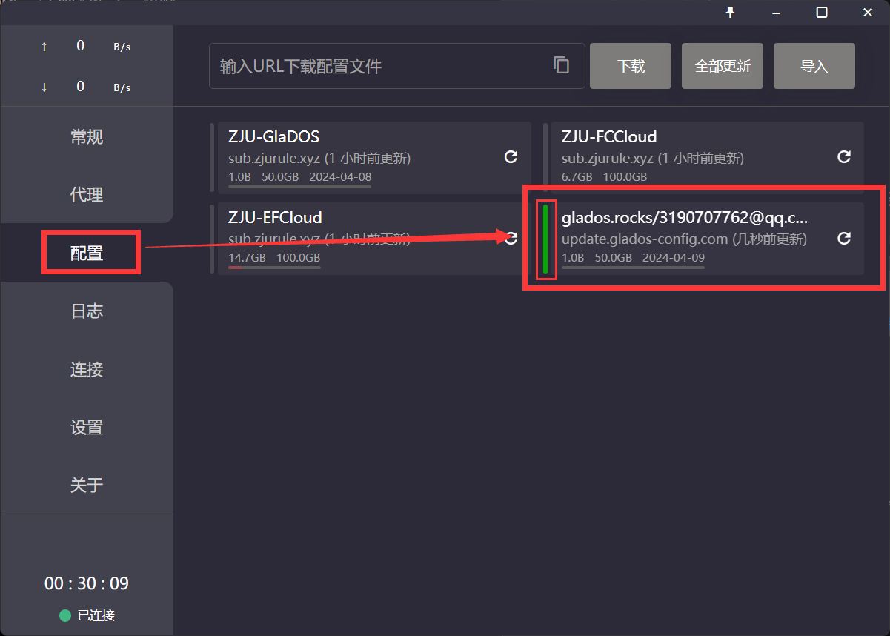

如果自动导入失败，可以尝试手动导入配置文件，复制上上步中配置文件的连接，通过 URL 下载配置文件，然后执行上一步中的操作  
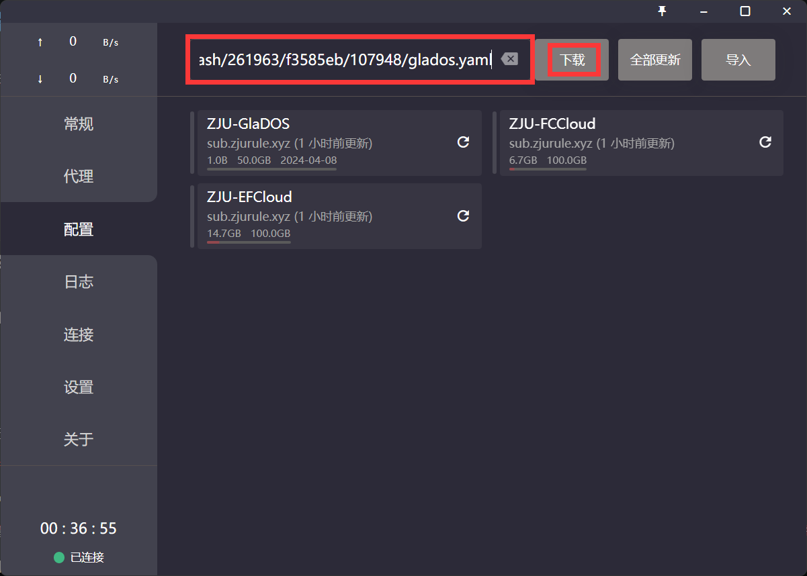

## 配置 Clash

开启模式图标，查看状态栏是否出现一个字母（蓝色代表未开启系统代理）  
  

开启系统代理，检查托盘图标是否变成黄色（黄色代表已开启系统代理）  
  

进行延迟检测，选择合适的代理模式和节点。节点的名称通常具有其物理地址的含义，例如 `HK` 代表香港节点，`US` 代表美国节点；绿色数字代表延迟，越低越好，红色 Timeout 代表与该节点通讯异常，不建议选择  

打开浏览器，访问 https://www.google.com/ 检查是否成功科学上网  

**Enjoy your free time!**

# Android/HarmonyOS

## 安装 Clash for Android

在 https://github.com/Kr328/ClashForAndroid/releases 找到最新的 Clash for Android 发布版本（截至 2023 年 7 月 1 日，最新版为），下载手机对应架构的安装包并安装（通常是下图圈出的版本）  
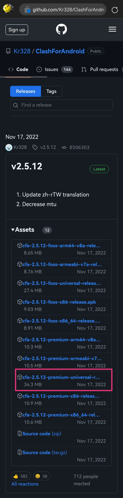

如果无法下载，可以参考 Tips [我上不了 GitHub](#我上不了-github) 从电脑上下载所需 .apk 文件给手机安装

## 导入配置文件

参考上文订阅 GlaDOS 后，在 https://glados.rocks/console/clash 页面将配置文件导入 Clash  
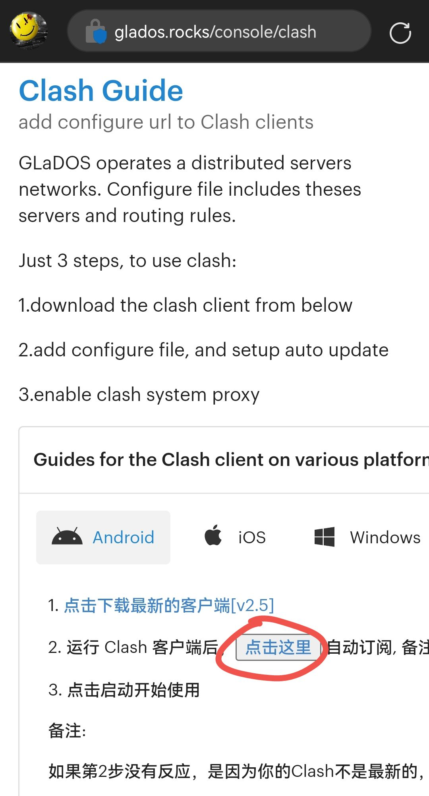  
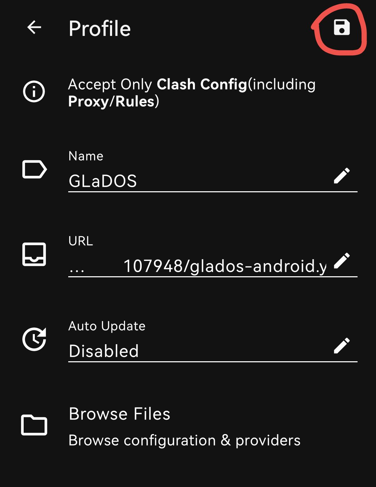

## 配置 Clash

激活 GlaDOS 配置文件并开启代理  
  
  

测速并选择合适的代理模式和节点  
  

（可选）添加 Clash 到 Android 小组件，更方便开关  

# Tips

## 我上不了 GitHub

GitHub 的服务器在境外，国内访问有时不稳定，可以使用 Watt Toolkit（原名 Steam++）加速 GitHub 等服务

在官网 https://steampp.net/ 下载 Watt Toolkit。该软件完全免费且开源，可以放心使用  

推荐从微软商店下载，国内可用且稳定自动更新  

将软件语言改为中文（开启加速功能的必要条件！）  

全选加速服务，关闭 GitHub Api（可能与 GitHub Copilot 等服务冲突）并开始加速  

出现“加速已启动成功”即可  

## Clash 中代理模式的区别

Clash 中有四种代理模式：全局代理、规则代理、直连和脚本，它们各有区别和优劣  

- 全局代理：所有流量都通过代理服务器。对流量消耗较大，可能无法使用部分国内服务
- 规则代理：根据规则选择性地通过代理服务器。基本可以理解为“只有外网流量走代理”，对流量消耗较小，基本可以常开。偶尔出现规则之外的情况，可以使用外部规则转换器如 ZJU-Rule 等优化代理规则或开启全局代理
- 直连：所有流量都不通过代理服务器。暂时无法科学上网，和关闭系统代理差不多
- 脚本：看这篇教程的人不需要懂这个

## Windows 突然无法上网

如果你发现电脑联网但无法访问任何网站，可以尝试打开 Clash，开启系统代理再退出 Clash。该问题可能是由于上一次 Clash 未正常退出导致 DNS 故障，开启系统代理后 Clash 会自动修复 DNS。如果仍未能修复，尝试以管理员身份启动 cmd，输入 `netsh winsock reset` 回车 `ipconfig /flushdns`，重启电脑  
  

## 无法使用 ChatGPT、Netflix 等特定服务

代理节点质量较差，无法突破 ip 封锁。尝试更换节点或更换、自建机场。使用 ChatGPT 的详细教程可以参考 https://github.com/Sha1rholder/use-ChatGPT-in-GFW
