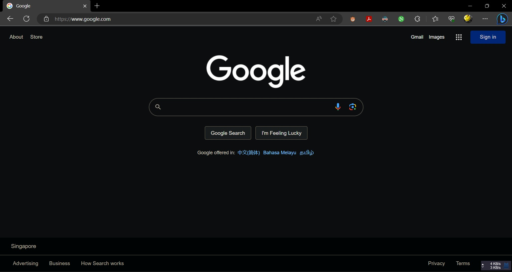

# Clash翻墙教程

2025年9月25日更新：

1. 由于软件长期停更的安全性问题，用Clash Verge Rev取代了Clash for Windows（Windows系统），并删掉了下载链接
2. 原因同上，用Clash Meta取代了Clash for Android（安卓系统），并删掉了下载链接
3. 由于镜像站稳定性问题，删掉了Watt Toolkit（原Steam++）加速GitHub等服务的教程
4. 删掉了过时的ChatGPT使用教程

## 订阅机场

先找个机场，具体选择哪家请咨询身边朋友。恕作者不想沾什么利益关系。机场是黑产，跑路风险极大，因此绝对不推荐包年订阅。普通用户没有能力了解机场的稳定性和速度，加之最近频繁发生的订阅地址污染问题，建议同时至少保持订阅两家机场，以防失联

首先注册并购买一家机场的订阅，新手一般选最便宜的即可，无论是月付还是不限时流量包。机场的GUI基本都是公版的，大同小异，稍微摸索下即可  

购买订阅后在主页选择复制**订阅链接**并将链接保存好。不推荐从机场下载客户端，因为可能包含恶意软件。`导入至Clash`选项不一定适配当前我们使用的Clash版本，所以也不推荐使用  

## Windows11

### 安装Clash Verge Rev

下载本文发布时最新版Clash Verge Rev (v2.4.2)：<https://github.com/clash-verge-rev/clash-verge-rev/releases/download/v2.4.2/Clash.Verge_2.4.2_x64-setup.exe>

或在Clash Verge Rev官方仓库地址 <https://github.com/clash-verge-rev/clash-verge-rev> 找到并下载您所需的版本

一路点击`Next` `Next` `Install`就好了，其他什么都不要改。这个软件体积很小，装在C盘不会有任何问题；也不要勾选`Do not create shorcuts`以免未来找软件安装目录麻烦

### 导入订阅链接

将Clash调成中文  

将订阅的配置文件链接粘贴进`订阅文件链接`栏，下载配置文件。下载完成后点击刚下载好的配置文件切换过去（左边会变绿）  
  

点击弹出来的配置文件方块，当它变色了，就是已经激活了  

### 打开系统代理

将Clash图标从隐藏的区域拖到任务栏，方便监控系统代理的开关情况  
  

紫色小猫图标就是“系统代理已关闭”的意思。现在回到Clash首页打开系统代理  
  

查看右下角小猫图标，此时应该变橙色了  

### 选择代理模式和节点

点击网络测速图标进行延迟检测，根据节点质量选择合适的代理模式和节点。一般来说选择`规则`后自动选择节点即可。节点的名称通常表示其物理地址，例如`HK`代表香港节点，`US`代表美国节点；绿色数字代表延迟，越低越好，红色Timeout代表与该节点通讯异常，无法使用  

由于地理位置最近，自动选择容易选择香港节点。部分海外服务如Anthropic在香港不可用，往下滚动节点列表找到其他地区的可用节点（如美国、日本节点）即可

打开浏览器，访问 <https://www.google.com> 检查是否成功科学上网  

如果用着用着突然连不上外网了，重新测速并选择合适的节点即可

### 更新订阅

GFW是动态更新的，因此各个节点都随时可能被墙，表现为订阅列表里的节点一片红Timeout，这时候你就该手动更新节点了。在`订阅`点一下刷新图标即可  

如果刷新订阅时报错了，很可能是订阅链接本身也被墙了或机场跑路了。如果是前者，上机场官网重新复制并导入一下链接，再将原来的配置文件删掉即可  

## Android

### 安装Clash Meta for Android

下载本文发布时最新版Clash Meta for Android (v2.11.7-universal)：<https://github.com/MetaCubeX/ClashMetaForAndroid/releases/download/v2.11.17/cmfa-2.11.17-meta-universal-release.apk>

或在Clash Meta for Android官方仓库地址 <https://github.com/MetaCubeX/ClashMetaForAndroid> 找到并下载您所需的版本

Clash Meta for Android的图标为  

### 导入订阅链接

打开软件，进入`Profile`页面  

点击右上角加号添加订阅  

选择`Improt from URL`从URL导入。如果导入失败，你也可以从电脑上把配置文件下载好后存到手机上，再选择`Import form File`从文件导入  

把订阅链接粘贴进URL框中，点击右上角保存。你还可以设置配置文件名`Name`和`Auto Update`自动更新周期，推荐将其设为10000，这意味着每10000分钟（约一周）自动更新一次订阅。作用参考上文[更新订阅](./README.md#更新订阅)  

### 打开系统代理

回到`Profile`页，点选刚导入的配置文件后回到首页  

打开系统代理  

点选`Proxy Mode`，点击右下角测速按钮测速，并选择合适的节点  
  

### 设置快捷开关（可选）

可以把Clash Meta for Android的快捷方式放置于系统的下拉菜单中，方便随时开关代理，具体步骤如下

点击编辑快捷方式按钮  

找到Clash Meta的按钮并将其拖到快捷方式栏中  

之后轻触该快捷方式就可以切换系统代理开关，长按就可以打开APP  

## 备注

### 选择合适的Clash代理模式

Clash中有三种代理模式：全局、规则和直连，有时需在不同场景下使用不同代理模式  

- 全局：所有流量都通过代理服务器。对流量消耗较大，可能无法使用部分国内服务
- 规则：根据规则选择性地通过代理服务器。基本可以理解为“只有外网流量走代理”，对流量消耗较小，基本可以常开。但是如果出现规则之外的情况导致某些服务无法使用，可以切换成全局代理
- 直连：所有流量都不通过代理服务器。等于关闭系统代理

### Windows突然无法上网

如果你发现电脑联网但无法访问任何网站，可能是由于上一次Clash未正常退出导致了DNS故障，重新开启系统代理后Clash会自动修复DNS。如果仍未能修复，尝试以管理员身份启动CMD，输入`netsh winsock reset`回车`ipconfig /flushdns`回车，然后重启电脑  
  
